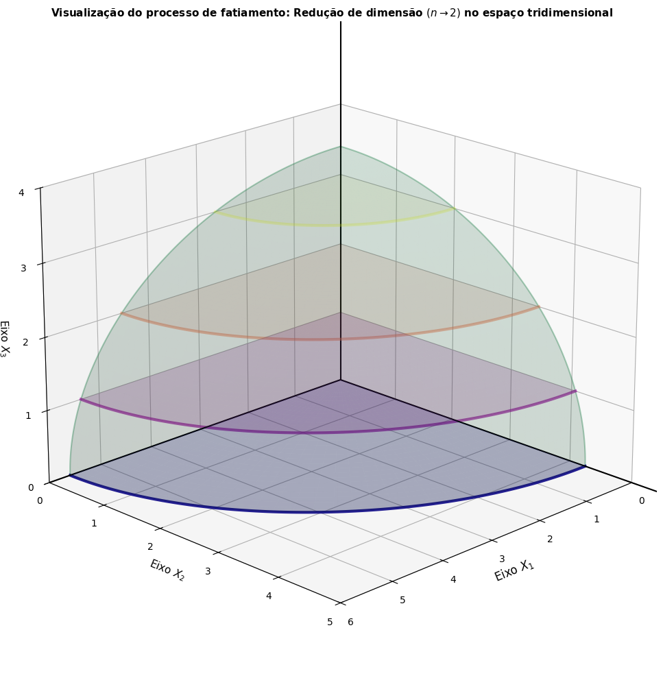

# Um algoritmo pseudopolinomial para maximizar uma função objetivo linear sobre pontos inteiros em elipsoides n-dimensionais 📐

Este repositório contém o código-fonte em LaTeX e os recursos analíticos referentes ao meu Trabalho de Conclusão de Curso (TCC) em Matemática na **Universidade Federal do Recôncavo da Bahia (UFRB)**.

## 👨‍🔬 Autor e Orientação
* **Autor:** Marcos Vinícius Barreto dos Santos
* **Orientador:** Prof. Dr. Eleazar Gerardo Madriz Lozada (CETEC/UFRB)
* **Status:** Em desenvolvimento (Defesa prevista para Julho/2026)

## 📌 Sobre o Projeto
O trabalho foca na análise, modelagem poliedral e fundamentação teórica do **Algoritmo de Otimização Inteira em Elipsoides (AIOE)**. O método utiliza técnicas de fatiamento ortogonal sequencial para mapear os pontos extremais da envoltória convexa discreta (*Integer Hull*) de um elipsoide $n$-dimensional.

## 📚 Contribuições Matemáticas

Esta pesquisa estabelece os seguintes resultados teóricos para o algoritmo AIOE:

- Demonstração do Lema da Maximalidade;
- Demonstração do Teorema de Convergência Global;
- Análise de complexidade computacional pseudopolinomial para dimensão fixa, limitada superiormente por $O(n \cdot \lfloor a_{n-1} \rfloor^{n-1})$;
- Formulação matemática do método de fatiamento sequencial em elipsoides.

## 🎥 Demonstrações e Recursos Visuais
Para garantir o acesso e a perenidade dos recursos visuais de modelagem geométrica do algoritmo, utilizamos o YouTube como plataforma de hospedagem. O projeto conta com duas abordagens visuais distintas:

### 1. 🧬 Introdução à Otimização Inteira (Perspectiva Didática)
* ▶️ [**Assistir animação didática no YouTube**](https://youtu.be/bKN_NNsvDd0?si=3sigzNJXPA29Twyz)

**Guia de Compreensão Intuitiva:** Vídeo desenvolvido para introduzir conceitos básicos de Otimização Discreta sem jargões complexos. Ilustra geometricamente como as curvas de nível da função objetivo percorrem a região factível até atingir o ponto ótimo inteiro.

### 2. 📊 Dinâmica do Algoritmo AIOE (Perspectiva Técnica)
* ▶️ [**Assistir animação técnica no YouTube**](https://youtu.be/K7HpVdJK1hY?si=EuyrtPGT7hsRbw5P)

**Guia de Visualização Avançada:** O vídeo ilustra a varredura sistemática para encontrar pontos ótimos no conjunto $\mathbb{Z}_+^2$, operando no fecho de um elipsoide em $\mathbb{R}_+^2$. Demonstra os deslocamentos discretos rente à fronteira combinatorial através da execução das funções auxiliares $f_a$ e $g_a$.

---

### 3. 🖼️ Recurso Estático Complementar: Redução Dimensional
Abaixo, a representação geométrica do processo de fatiamento sequencial detalhado na monografia, mostrando como o algoritmo colapsa sucessivamente subproblemas de dimensões superiores ($\mathbb{R}^3$) em seções discretas bidimensionais analíticas ($\mathbb{R}^2$):

---

## 🛠️ Ferramentas Utilizadas
* **LaTeX:** Para a redação acadêmica seguindo as normas ABNT (via classe `abntex2`).
* **VerbTeX Pro:** Ambiente mobile para gerenciamento, edição de código LaTeX e compilação via `PdfLaTeX`.
* **GitHub:** Hospedagem permanente do texto e dos recursos multimídia teóricos.

---
© 2026 Marcos Vinícius Barreto - Licença MIT